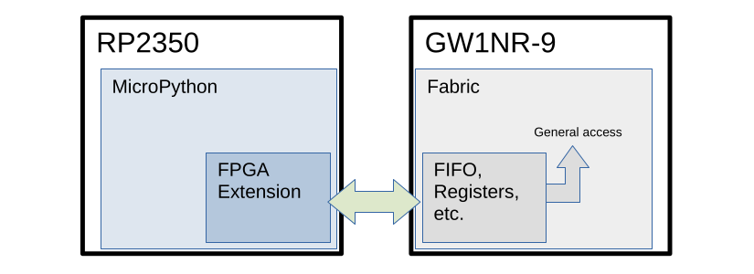
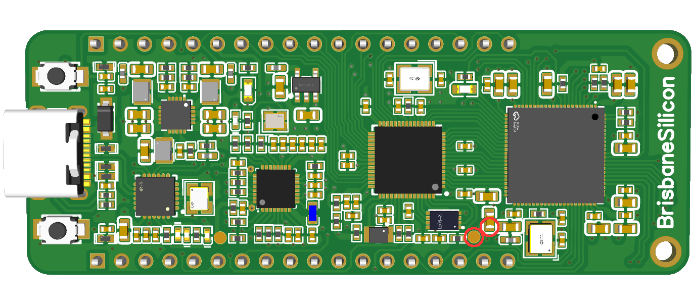

# EPM11-MCU


Example project for the MCU component of the [EPM11](https://brisbanesilicon.com.au/epm11) MCU-FPGA development board by [BrisbaneSilicon](https://brisbanesilicon.com.au/).
<br><br>

## Table of Contents

*   [Overview](#overview)
*   [Getting Started](#getting-started)
*   [Board Setup](#board-setup)
*   [Build](#build)
*   [Upload](#upload)
*   [Examples](#examples)
*   [Pinout File](#pinout-file)
*   [Authors](#authors)
*   [Appendix](#appendix)
*   [Support](#support)
<br>

## Overview

This project allows the user to build an custom Micropython layer for MCU-FPGA communications and upload it onto the [EPM11](https://brisbanesilicon.com.au/epm11) MCU-FPGA development board. Alternatively, a pre-built version of the module is hosted in the '[bin](https://github.com/BrisbaneSilicon/EPM11-MCU/tree/master/bin)' for users that simply want to upload and utilise it.

This project also contains the currently supported Micropython image, a [pin-mapping script](https://github.com/BrisbaneSilicon/EPM11-MCU/blob/master/script/pinout.py), as well as various example scripts.

The core component of this project (together with its [EPM11-FPGA](https://github.com/BrisbaneSilicon/EPM11-FPGA) sister project) is the MCU-FPGA comms layer. This layer can be leveraged by the user for 'out of the box' MCU-FPGA communication, upon which their custom functionality can be developed.





After the comms layer of this project has been built and uploaded, and its [EPM11-FPGA](https://github.com/BrisbaneSilicon/EPM11-FPGA) sister project flashed to the FPGA, communication between the two IC's is as simple as:

#### MCU

On the RP2350 MCU, via a Python program or REPL:

```python
import fpga

fpga.write(0x4, 0xFF)
```

#### FPGA

The Python snippet above will produce a AXI-Lite (ish) write transaction, with wdata=0xFF and addr=0x4. This interface is plumbed to the user module '[user.sv](https://github.com/BrisbaneSilicon/EPM11-FPGA/blob/master/proj/common/systemverilog/user.sv)':

```systemverilog
output  reg [31:0]  cpu_addr,
output  reg [31:0]  cpu_wdata,
output  reg [3:0]   cpu_wstrb,
input       [31:0]  cpu_rdata,
output  reg         cpu_valid,
input               cpu_ready
```

<br>

## Getting Started

Fulfill the below prerequisites.

### Prerequisites

1. A PC running an x64 compatible, Debian-based flavour of Linux or Windows 11.
   - Other flavours of Linux may work but aren't officially supported.
   - We recommend [Ubuntu](https://ubuntu.com/).
2. An installation of [GIT](https://git-scm.com/).
3. Either an installation of [Thonny](https://thonny.org/) or a command-line based tool for interacting with the RP2350 MCU, i.e. [mpremote](https://pypi.org/project/mpremote/).
4. A copy of this repository.
   - Launch a terminal program.
   - Navigate to the directory in which you wish to host the EPM11 repository.
   - `git clone https://github.com/BrisbaneSilicon/EPM11-MCU.git`
  
If you wish to build the custom Micropython layer:

1. A copy of Micropython (located in the same root directory as this repository)
  - Launch a terminal program.
  - Navigate to the same directory in which you host the EPM11 repository.
  - `git clone https://github.com/BrisbaneSilicon/EPM11-MCU.git`
2. An installation of version 13.3.rel1 of the Arm cross compiler toolchain. See [here](https://github.com/RT-Thread/toolchains-ci/releases).
3. An installation of Python3.
4. An installation of the Python library pyelftools (`pip install 'pyelftools>=0.25'`)

<br>

## Board Setup

If you recently purchased a board you might need to flash the Micropython image for the first time, or if you wish to upload a customized Micropython image, follow the steps below.

1. Unplug the EPM11 from your PC.
2. Short TP2 to GND. For reference, TP2 and the closest GND pad are circled in the diagram below. A small pair of tweezers or a single-strand wire are suggested to be utilized for this step.
3. Plug the EPM11 into your PC, keeping the TP2 - GND short in place.
4. Once the EPM11 is plugged into your PC, remove the TP2 - GND short.
5. A new folder ‘RP2350’ should now be mounted by your OS. Simply drag and drop the new MicroPython image (i.e. the currently supported image is located in the 'bin' directory of this repository) to that folder.
6. Once the new image has been uploaded, the ‘RP2350’ folder will unmount and the image will boot.



<br>

## Build

After fulfilling all of the prerequisites you are ready to build the EPM11 MCU comms layer! Simply perform the following:

### Linux

```bash
cd <this repository directory>/fw/mpy
PATH=/<arm gnu toolchain installation directory>/arm-gnu-toolchain-13.3.rel1-x86_64-arm-none-eabi/bin/:$PATH make
```
Substituting `<arm gnu toolchain installation directory>` for the actual install directory.

### Windows

Coming soon!

<br>

## Upload

To upload either the pre-built or manually built `fpga.mpy` comms layer, perform either of the following. After uploading the module, you should be able to successfully `import fpga` via the MCU REPL (or program).

### Thonny

1. Click 'View' - 'Files'.
2. In the 'This computer' file tree (top left) navigate to the directory that hosts 'fpga.mpy'.
3. Right-click 'fpga.mpy' and select 'Upload to /'

### mpremote

```bash
cd <directory that hosts fpga.mpy>
mpremote fs cp fpga.mpy :fpga.mpy
```

<br>

## Examples

### Bus Test Simple

The [simple bus test](https://github.com/BrisbaneSilicon/EPM11-MCU/blob/master/script/examples/bus_test_simple.py) script demonstrates bi-directional communication between the RP2350 MCU and FPGA. Simply upload it (in the same manner you uploaded the fpga.mpy module), and flash the FPGA with firmware that has been built with the ['-t' switch](https://github.com/BrisbaneSilicon/EPM11-FPGA/blob/master/README.md#build), and then run the example. It performs various register read/writes to verify the FPGA bus functionality. The output should be similar to the following:

```
	------- Begin: EPM11 FPGA Bus Test -------

|    Address   |     Write    |      Read    | Result |
|--------------|--------------|--------------|--------|
|  0x00000000  |  0xFFFFFFFF  |  0xFFFFFFFF  |  PASS  |
|  0x00000000  |  0xAAAAAAAA  |  0xAAAAAAAA  |  PASS  |
|  0x00000000  |  0x55555555  |  0x55555555  |  PASS  |
|  0x00000000  |  0x0000FFFF  |  0x0000FFFF  |  PASS  |
|  0x00000000  |  0xFFFF0000  |  0xFFFF0000  |  PASS  |
|  0x00000000  |  0x8BADF00D  |  0x8BADF00D  |  PASS  |
|  0x00000000  |  0x01234567  |  0x01234567  |  PASS  |
|  0x00000000  |  0x00000000  |  0x00000000  |  PASS  |
|  0x000000FC  |  0xFFFFFFFF  |  0xFFFFFFFF  |  PASS  |
|  0x000000FC  |  0xAAAAAAAA  |  0xAAAAAAAA  |  PASS  |
|  0x000000FC  |  0x55555555  |  0x55555555  |  PASS  |
|  0x000000FC  |  0x0000FFFF  |  0x0000FFFF  |  PASS  |
|  0x000000FC  |  0xFFFF0000  |  0xFFFF0000  |  PASS  |
|  0x000000FC  |  0x8BADF00D  |  0x8BADF00D  |  PASS  |
|  0x000000FC  |  0x01234567  |  0x01234567  |  PASS  |
|  0x000000FC  |  0x00000000  |  0x00000000  |  PASS  |
|  0x5A5AA5A4  |  0xFFFFFFFF  |  0xFFFFFFFF  |  PASS  |
|  0x5A5AA5A4  |  0xAAAAAAAA  |  0xAAAAAAAA  |  PASS  |
|  0x5A5AA5A4  |  0x55555555  |  0x55555555  |  PASS  |
|  0x5A5AA5A4  |  0x0000FFFF  |  0x0000FFFF  |  PASS  |
|  0x5A5AA5A4  |  0xFFFF0000  |  0xFFFF0000  |  PASS  |
|  0x5A5AA5A4  |  0x8BADF00D  |  0x8BADF00D  |  PASS  |
|  0x5A5AA5A4  |  0x01234567  |  0x01234567  |  PASS  |
|  0x5A5AA5A4  |  0x00000000  |  0x00000000  |  PASS  |
|  0xFFFFFFFC  |  0xFFFFFFFF  |  0xFFFFFFFF  |  PASS  |
|  0xFFFFFFFC  |  0xAAAAAAAA  |  0xAAAAAAAA  |  PASS  |
|  0xFFFFFFFC  |  0x55555555  |  0x55555555  |  PASS  |
|  0xFFFFFFFC  |  0x0000FFFF  |  0x0000FFFF  |  PASS  |
|  0xFFFFFFFC  |  0xFFFF0000  |  0xFFFF0000  |  PASS  |
|  0xFFFFFFFC  |  0x8BADF00D  |  0x8BADF00D  |  PASS  |
|  0xFFFFFFFC  |  0x01234567  |  0x01234567  |  PASS  |
|  0xFFFFFFFC  |  0x00000000  |  0x00000000  |  PASS  |

Summary: 0 of 32 tests failed
```

<br>

## Pinout File

The [Pinout File](https://github.com/BrisbaneSilicon/EPM11-MCU/blob/master/script/pinout.py) is a useful Python module that can be imported into your custom scripts as it contains the RP2350 MCU I/O pin mapping (header J5 in the [schematic](https://brisbanesilicon.com.au/docs/EPM11_Schematic.pdf)) as well as the raw mapping of the bus from the MCU to the FPGA.

<br>

## Authors

- [@brisbanesilicon](https://github.com/BrisbaneSilicon)
- [@CheekiestMonkey117](https://github.com/CheekiestMonkey117)

<br>

## Appendix

For developing with the project, we recommend [Sublime Text](https://www.sublimetext.com/), with the VHDL and/or Systemverilog syntax highlighing enabled.<br><br>
If you like this project, follow us on X [here](https://x.com/brisbanesilicon)!

<br>

## Support

For support, email support@brisbanesilicon.com.au.
